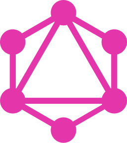

<h1 align="center">
    Hey there, I'm Nick!
    
</h1>

<h2 align="center">Senior Software Developer | React | React-Native | Flutter | Node.js</h2>

    

        
    

### Core Technologies:
<table>
    <tr align="center">
        <td align="center"  width="90" height="90">
            
             Javascript
        </td>
        <td align="center"  width="90"  height="90">
            
             Typescript
        </td>
        <td align="center"  width="90"  height="90">
            
             React
        </td>
        <td align="center"  width="90"  height="90">
            
             Next.js
        </td>
    </tr>
</table>

### Web Technologies:
<table>
    <tr align="center">
        <td align="center"  width="90"  height="90">
            
             HTML5
        </td>
        <td align="center"  width="90"  height="90">
            
             CCS3
        </td>
        <td align="center"  width="90"  height="90">
            
             SCSS
        </td>
        <td align="center"  width="90"  height="90">
            
             LESS
        </td>
        <td align="center"  width="90"  height="90">
            
             Tailwind
        </td>
        <td align="center"  width="90"  height="90">
            
             Mui
        </td>
        <td align="center"  width="90" height="90">
            
             Ant design
        </td>
        <td align="center"  width="90"  height="90">
            
             Bootstrap
        </td>        
        <td align="center"  width="90"  height="90">
            
             jQuery
        </td>
    </tr>
</table>

### Mobile Technologies:
<table>
    <tr align="center">
        <td align="center"  width="90"  height="90">
            
             RNative
        </td>
        <td align="center"  width="90"  height="90">
            
             Flutter
        </td>
    </tr>
</table>

### Backend & API:
<table>
    <tr align="center">
        <td align="center"  width="90"  height="90">
            
             Node.js
        </td>
        <td align="center"  width="90"  height="90">
            
             Express.js
        </td>
        <td align="center"  width="90"  height="90">
            
             Nest.js
        </td>
        <td align="center"  width="90"  height="90">
            
             GraphQL
        </td>
        <td align="center"  width="90"  height="90">
            
             MongoDB
        </td>
        <td align="center"  width="90"  height="90">
            
             Firebase
        </td>
        <td align="center"  width="90"  height="90">
            
             Sanity
        </td>
    </tr>
</table>

### Additional Languages:
<table>
    <tr align="center">
        <td align="center"  width="90"  height="90">
            
             Dart
        </td>
        <td align="center"  width="90"  height="90">
            
             Python
        </td>
    </tr>
</table>

### Build & Infrastructure:
<table>
    <tr align="center">
        <td align="center"  width="90"  height="90">
            
             Webpack
        </td>
        <td align="center"  width="90"  height="90">
            
             Babel
        </td>
        <td align="center"  width="90"  height="90">
            
             DigitalOcean
        </td>    
        <td align="center"  width="90"  height="90">
            
             CI/CD
        </td>
    </tr>
</table>

### Testing & Linting:
<table>
    <tr align="center">
        <td align="center"  width="90"  height="90">
            
             Jest
        </td>
        <td align="center"  width="90"  height="90">
            
             Eslint
        </td>
        <td align="center"  width="90"  height="90">
            
             Selenium
        </td>
    </tr>
</table>

### Development Tools:
<table>
    <tr align="center">
        <td align="center"  width="90"  height="90">
            
             Git
        </td>
        <td align="center"  width="90"  height="90">
            
             Postman
        </td>
        <td align="center"  width="90"  height="90">
            
             Yarn
        </td>
        <td align="center"  width="90"  height="90">
            
             Brew
        </td>
        <td align="center"  width="90"  height="90">
            
             Xcode
        </td>
        <td align="center"  width="90"  height="90">
            
             IntelliJ
        </td> 
        <td align="center"  width="90"  height="90">
            
             Android
        </td>
        <td align="center"  width="90"  height="90">
            
             Webstorm
        </td>   
    </tr>
</table>

### State Management:
<table>
    <tr align="center">
        <td align="center"  width="90"  height="90">
            
             Redux
        </td>
        <td align="center"  width="90"  height="90">
            
             Mobx
        </td>        
        <td align="center"  width="90"  height="90">
            
             Zustand
        </td>
    </tr>
</table>

### Design & Prototyping:
<table>
    <tr align="center">
        <td align="center"  width="90"  height="90">
            
             Figma
        </td>
        <td align="center"  width="90"  height="90">
            
             Sketch
        </td>
    </tr>
</table>

### GitHub Stats:
- **Version Control:** GitHub (personal), GitLab/Bitbucket (work)

<table>
  <tr>
      <td>
        
      </td>
      <td>
        
      </td>
  </tr>
  <tr>
      <td colspan=2 align="center">
        
      </td>
  </tr>
</table>
